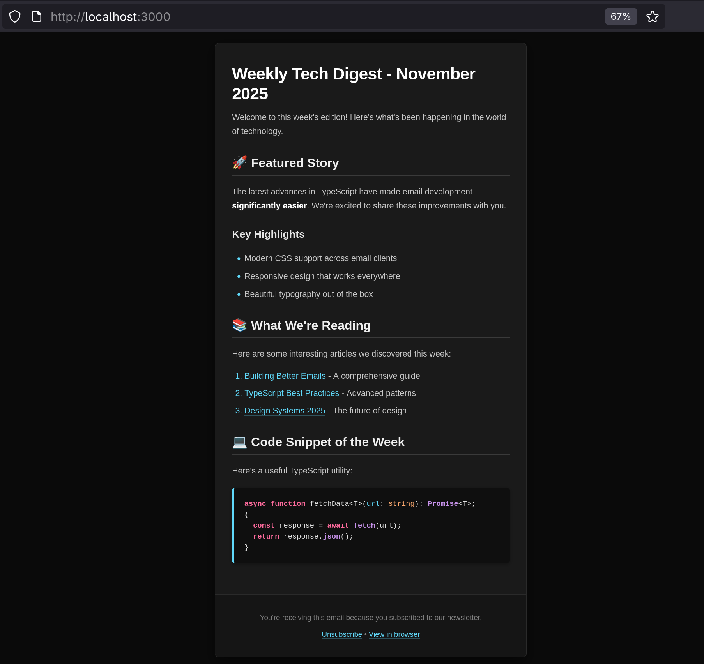
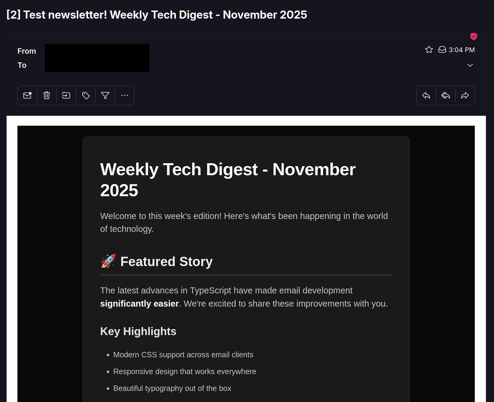

# Mail-md

An extremely basic markdown to newsletter cli tool. As easy as `mail-md ./newsletter.md` to immediately send to your entire mailing list!

You can update the template and styling to whatever fits your needs.

## Usage

```bash
pnpm build

pnpm link

mail-md ./docs/example.md --preview

mail-md ./docs/example.md --test me@mydomain.com

mail-md ./docs/example.md
```

## Preview

[Example markdown](./docs/example.md)



> note that some email providers will add a white border around the email



## Limitations

- Resend only (100 batch max)
- Only one theme
